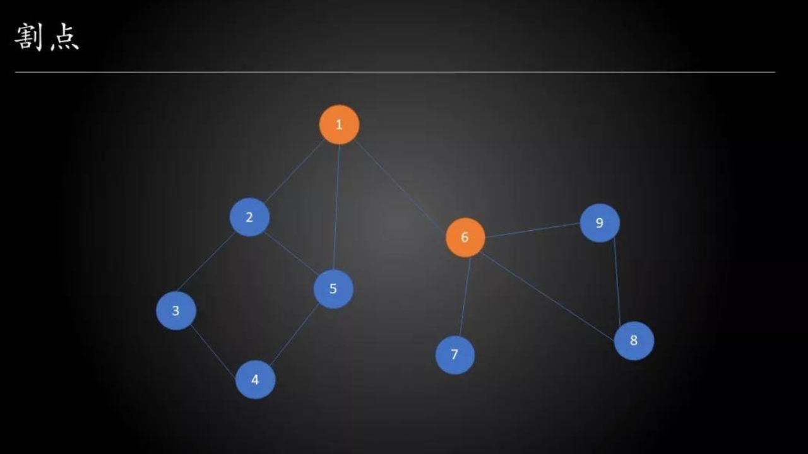
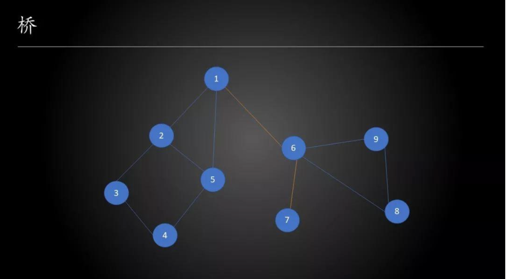

### Tarjan 算法
- 本质上是一个基于 DFS（深度优先搜索）的算法，用于求解图的连通性问题

#### 基本概念
##### 无向图的割点与桥
- 若一个图中每条边都是无方向的，则称为无向图

##### 割点
- 若从图中删除节点 $x$ 以及所有与 $x$ 关联的边后，图将被分成两个或两个以上不相连的子图，那么称 $x$ 为图的<b>割点</b>

- 上图中的 $1$ 与 $6$ 就是割点

##### 桥（割边）
- 若从图中删除边 e 之后，图将分裂成两个不相连的子图，那么称 $e$ 为图的桥或割边

##### 如何求解图的割点与桥？
